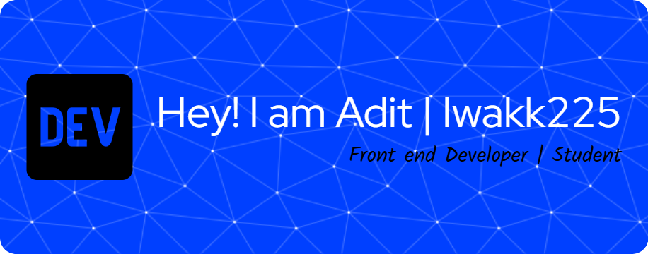

<!--
**Iwakk225/Iwakk225** is a ✨ _special_ ✨ repository because its `README.md` (this file) appears on your GitHub profile.

Here are some ideas to get you started:

- 🔭 I’m currently working on ...
- 🌱 I’m currently learning ...
- 👯 I’m looking to collaborate on ...
- 🤔 I’m looking for help with ...
- 💬 Ask me about ...
- 📫 How to reach me: ...
- 😄 Pronouns: ...
- ⚡ Fun fact: ...
-->
## Hello World!!! 👋
#### 💫About me
- 🔭 I am currently a vocational school student
- 🌱 I’m currently learning HTML, CSS and Javascript

#### 💻Skills :

#### 🌐Social Media

 

#### 📚My Github Stat

